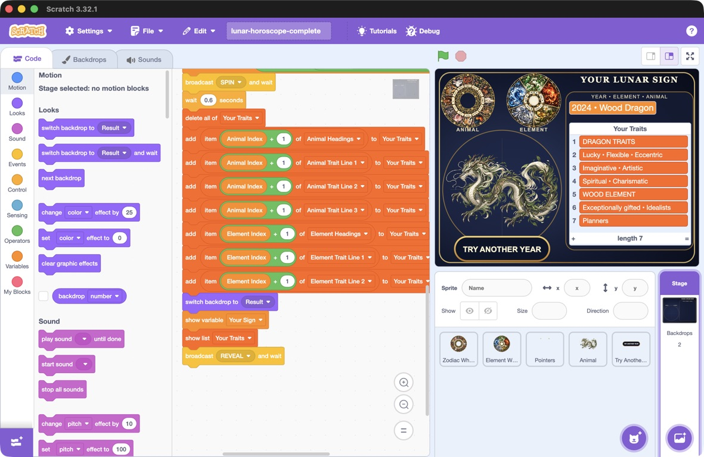

## Try another year

Let the player restart from the result screen without pressing the green flag.

> [!TASK]
>
> Select **Try Another Year**. Add this new `REVEAL` script to show the button when the result appears. Keep its `START` script, which hides it at the beginning of a turn.
>
> ```blocks3
> +when I receive [REVEAL v]
> +wait (0.2) seconds
> +show
> +go to [front v] layer
> ```

> [!TASK]
>
> Add another script that runs when the button sprite is clicked.
>
> ```blocks3
> +when this sprite clicked
> +hide
> +broadcast [START v]
> ```
>
> Hiding the button straight away prevents more clicks while the project resets. `START` returns the wheels to their starting positions, clears the previous result, and asks for another year.

> [!TASK]
>
> **Test your project.** After revealing `2024`, click **TRY ANOTHER YEAR** and enter `2026` to check that the result becomes `2026 • Fire Horse` with seven fresh trait rows.
>
> Example result for `2024` in the completed Scratch project.
>
> 
