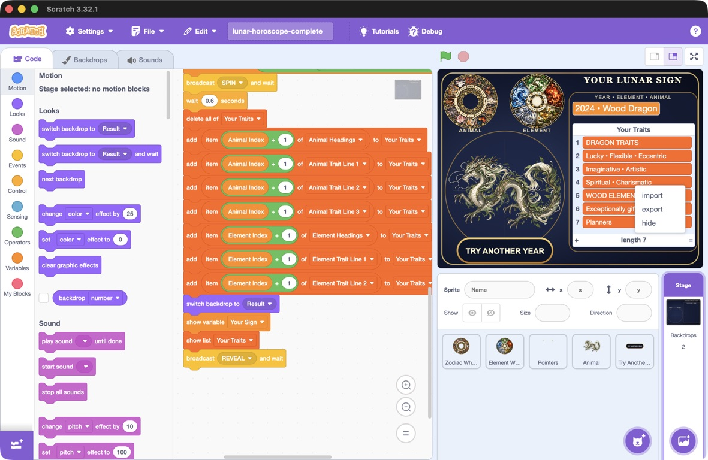

## Keep your traits

Export the **Your Traits** list as a text file you can keep and open outside Scratch.

> [!TASK]
>
> Run your project and enter a year. Wait for the animal and the seven rows in **Your Traits** to appear.
>
> Keep this result on the Stage while you export it. **TRY ANOTHER YEAR** clears the list ready for a new result.

> [!TASK]
>
> In the Scratch editor, right-click inside the **Your Traits** list on the Stage to open its context menu. On a Mac, you can hold **Control** and click.
>
> 
>
> Choose **export** from the menu.

<!-- Additional screenshot pending: the export option highlighted or the completed save operation. -->

> [!TIP]
>
> If you cannot see the coding area, leave full-screen mode or choose **See inside** first. Right-click the list displayed on the Stage, rather than a block in the Variables category.

> [!TASK]
>
> Scratch downloads a file called `Your Traits.txt`. If a save window appears, choose a folder and save the file; otherwise, look in your **Downloads** folder.
>
> Give the file a name that includes your chosen year, such as `lunar-traits-2024.txt`. Keep `.txt` at the end. The year is shown in **Your Sign**, but is not included in the exported list.

> [!TASK]
>
> **Test your project.** Open your saved `.txt` file in a text editor, such as Notepad or TextEdit. Check that it contains the same seven rows as **Your Traits**, with each list item on its own line.
>
> For `2024`, the two headings should be `DRAGON TRAITS` and `WOOD ELEMENT`. Long rows may wrap on screen, but they still belong to one list item.
>
> You now have a copy of these traits to keep, even after you try another year in Scratch.
